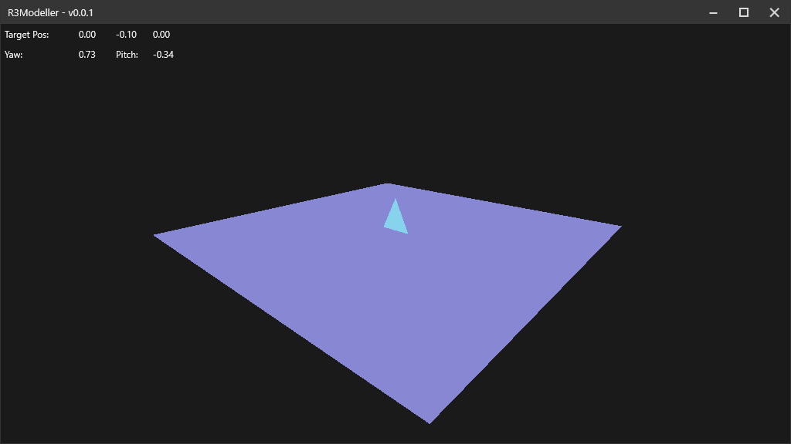

# R3Modeller
A (WIP) 3d modelling program, using OpenGL, C# and WPF/MVVM

Not planning on competing with blender/C4d or anything lol... this is just a learning tool. I know so little about writing a performant OpenGL 
app and mesh loading/generation, so I hope to learn that by writing a 3D modelling program

I copied a bunch of boilerplate code from my other project, FramePFX, but I'm not even using 1% of it, which is why the project is so big. Most of the rendering code is in MainWindow.xaml.cs and SceneObject (I kinda just splattered a bunch of code everywhere for ease lol)

## Preview
This is what i've done so far. You can orbit by holding ALT and the left mouse button and moving your mouse

## OpenGL -> WPF
`glReadBuffer` and `glReadPixels` are used to write the backbuffer's pixels into a WriteableBitmap's BackBuffer.

This does mean that rendering is done on the WPF/Main thread. I hope to soon figure out a way to implement higher level double buffering (using two WriteableBitmaps). I could just Lock the bitmaps and only unlock when a render is complete, but there's a problem with WPF in that when you move or resize (can't remember which once specifically, probably both) a window, DUCE will block and wait for the WriteableBitmap's Unlock function to be called, meaning Lock() and Unlock() need to be called in a somewhat short succession to prevent the entire app freezing forever
